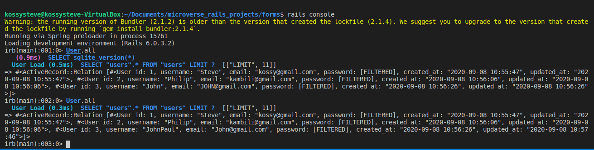

## re_former
This is a microverse rails project to to work with HTML forms and form helper methods in rails.

## Code execution view:


 

## Built With
Ruby on Rails 
VsCode 
Active Records

## Getting Started
To get a local copy up and running follow these simple example steps:

```
Clone this repository into your local machine.
https://github.com/KossySteve/redditt_clone.git
cd redditt_clone
git checkout development

```

## Usage
Open a new terminal and type

```python
 $ rails server
 $ type http://localhost:3000/users/new to create new users
 $ type http://localhost:3000/users/:id/edit to edit users
 
 $ rails console

 $ u = User.all
 $ u #To check the user content

```
## Validators
Rubocop
Stickler

## Authors
👤 **Ezeokwelume Stephen Kosisochukwu**

- Github: [KossySteve](https://github.com/KossySteve)
- Linkedin: [Kossy Steve](https://www.linkedin.com/in/steve-ez-b090ba198/)


## 🤝 Contributing

Contributions, issues and feature requests are welcome!

Feel free to check the [issues page](issues/).

## Show your support

Give a ⭐️ if you like this project!

## 📝 License

This project is [MIT](lic.url) licensed.

